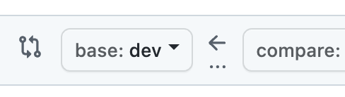

# 요청 보내는  branch 확인 !
  
- [ ]  pr 요청을 보내는 branch 를 확인하였습니다

### 작업 카테고리

- [ ] issue or bug fix
- [ ] feature implementation
- [ ] review or testing
- [ ] etc.

### Issue or Bug Fix

- 관련 이슈 :  [어디서 어떤 오류가 발생했었는지]
- 변경된 부분 : [수정한 파일/코드 위치]
- 수정 내용 : [간단하게 요약]

### Feature Implementation

- 관련 파일 : [어느 파일의 변동]
- 구현 내용 : [간단하게 요약]
- 테스트 계획  또는 완료 사항 :

### Review or Testing

- 핵심 사항 : [어떤 기능의 테스트인지]
- 검토할 내용 : [ 테스트 할 내용과 이상적인 흐름]
- 검토 방법 : [검토 또는 테스트 방법 설명]

### Refactoring

- 변경된 부분 : [수정한 파일/코드 위치]
- 수정 내용 : [간단하게 요약]
- 추가될 사항 : [추가로 구현 계획중인 기능]
